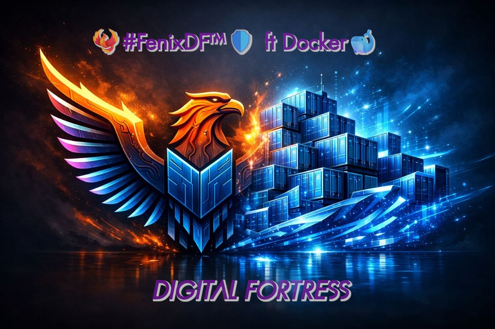

# 🐦‍🔥 FenixDF CMS | Digital Fortress 🛡️

<p align="center">
  
</p>

<p align="center">
  <a href="https://hub.docker.com/r/fenixdf/fenixdf-cms">
    
  </a>
  <a href="https://github.com/FenixDF/fenixdf-cms">
    
  </a>
</p>

CMSimple_XH optimizado para ARM64/AMD64 con NGINX + PHP-FPM 8.2. El CMS más rápido y ligero para arquitecturas ARM64 (Raspberry Pi) y AMD64.

[](https://hub.docker.com/r/fenixdf/fenixdf-cms)

## 🚀 Uso rápido
```bash
docker run -d -p 8025:80 --name fenixdf fenixdf/fenixdf-cms:latest

🌐 Acceso

    URL: http://tu-servidor:8025

    Login: Esquina inferior derecha

    Contraseña: test (cambiar al entrar)

✨ Características

    Alpine Linux (~62MB)

    NGINX + PHP-FPM 8.2 con socket Unix

    Supervisor para gestión de procesos

    Persistencia con volúmenes

    Sin errores 502 Bad Gateway

🔧 Con persistencia
bash

docker run -d \
  --name fenixdf \
  --restart unless-stopped \
  -p 8025:80 \
  -v fenixdf_data:/var/www/html/cmsimple \
  -v fenixdf_content:/var/www/html/content \
  fenixdf/fenixdf-cms:latest

🐳 Docker Compose
yaml

services:
  fenixdf:
    image: fenixdf/fenixdf-cms:latest
    restart: unless-stopped
    ports:
      - "8025:80"
    volumes:
      - fenixdf_data:/var/www/html/cmsimple
      - fenixdf_content:/var/www/html/content
volumes:
  fenixdf_data:
  fenixdf_content:

📦 Tags

    latest - Última versión estable

    1.0.0 - Versión específica

📄 Licencia MIT

Mantenido por FenixDF | Digital Fortress 🛡️

🔗 Enlaces

Docker Hub: https://hub.docker.com/r/fenixdf/fenixdf-cms
GitHub: https://github.com/FenixDF/fenixdf-cms
